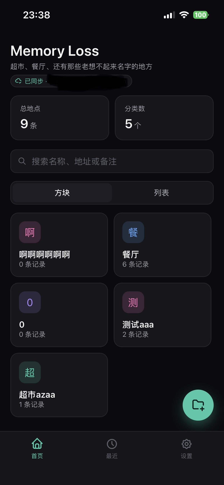
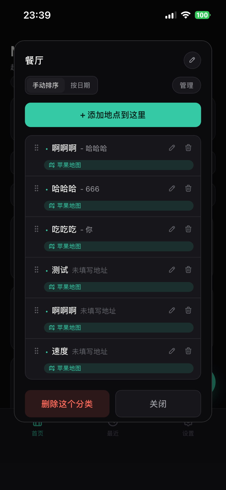

# Memory Loss

记住那些老想不起来名字的地方——超市、餐厅、还有各种随手想记一下的地点。

一个纯前端的单文件小工具，专为「加到 iPhone 主屏幕」使用而设计：暗色主题、分类方块、拖拽排序、按地址一键跳转导航，并且可以通过 [InstantDB](https://instantdb.com) 免费开通跨设备云同步。

## 截图

| 首页 | 分类详情 |
|---|---|
|  |  |

## 功能

- **分类管理**：按超市、餐厅等自建分类，方块视图可长按拖拽调整顺序（基于 [SortableJS](https://sortablejs.github.io/Sortable/)）
- **两种视图**：方块 / 列表左右滑动切换，列表内地点也支持拖拽排序
- **搜索**：首页顶部常驻搜索框，支持模糊匹配名称、地址、备注
- **分类详情弹窗**：手动排序 / 按创建日期排序切换，支持批量选择删除，一键跳转到编辑
- **每个地点可单独指定导航 App**：苹果地图 / 谷歌地图，覆盖全局默认设置
- **备注字段**：记录营业时间、停车方式等零碎信息
- **数据备份**：设置页支持导出 / 导入 JSON 备份
- **两种存储模式**：
  - 不配置 InstantDB → 仅本机 `localStorage` 存储
  - 配置 InstantDB App ID → 邮箱验证码登录，数据云端实时同步，换设备也能看到

## 部署步骤

### 1. 部署静态页面（GitHub Pages）

把整个仓库（至少要有 `index.html`）推到 GitHub，进入仓库 **Settings → Pages**，选择部署分支即可拿到一个 `https://你的用户名.github.io/仓库名/` 的地址。

用手机 Safari 打开这个地址 → 分享 → **添加到主屏幕**，之后就跟原生 App 一样使用，图标、启动画面、去掉了地址栏。

### 2. 开通云同步（可选，强烈建议）

1. 注册 [instantdb.com](https://instantdb.com/dash)，创建一个新 App，复制它的 **App ID**
2. 打开 `index.html`，找到这一行，把值换成你自己的 App ID：
   ```js
   const INSTANT_APP_ID = "你的App ID";
   ```
3. 在 InstantDB 后台的 **Permissions** 页面，粘贴以下规则：
   ```json
   {
     "$users": {
       "allow": {
         "create": "data.email == '你的邮箱@example.com'"
       }
     },
     "places": {
       "bind": ["isOwner", "auth.id != null && auth.id == data.owner"],
       "allow": {
         "view": "isOwner",
         "create": "isOwner",
         "update": "isOwner",
         "delete": "isOwner"
       }
     },
     "categories": {
       "bind": ["isOwner", "auth.id != null && auth.id == data.owner"],
       "allow": {
         "view": "isOwner",
         "create": "isOwner",
         "update": "isOwner",
         "delete": "isOwner"
       }
     }
   }
   ```
   把 `你的邮箱@example.com` 换成你自己的邮箱。这条规则有两层作用：
   - `places` / `categories` 那两段：每条数据都只有它的所有者（`owner` 字段等于当前登录人）能读写，别人就算注册了也看不到你的数据
   - `$users` 那段是**真正挡住陌生人注册、消耗你 InstantDB 额度**的关键：InstantDB 会在注册（包括发送验证码）这一步就用后端强制执行这条规则，只有邮箱匹配的人才能注册成功，验证码根本不会发给别人——这一步是服务端强制的，不是前端拦截，没法被绕过

### 3. 本机模式（不想要云同步）

什么都不用改，`INSTANT_APP_ID` 保持默认占位值即可，数据会存在浏览器的 `localStorage` 里，仅限当前这台设备 / 当前这个浏览器。

## 技术栈

纯原生 HTML / CSS / JavaScript（ES Module），无构建步骤，单文件即可运行：

- [InstantDB](https://instantdb.com) — 实时数据库 + 邮箱验证码登录
- [SortableJS](https://sortablejs.github.io/Sortable/) — 拖拽排序
- [Tabler Icons](https://tabler.io/icons) — 图标字体

## 隐私说明

- 本机模式：数据只存在你自己的设备上，不会上传到任何地方
- 云同步模式：数据存储在你自己创建的 InstantDB App 里，受你在第 2 步配置的 Permissions 规则保护；这是你个人的实例，与本项目作者无关
